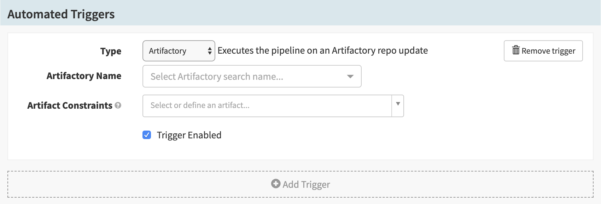
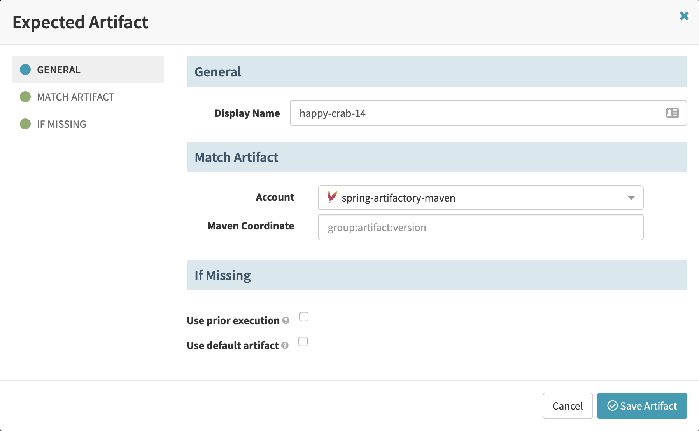

This guide explains how to add a [JFrog
Artifactory](https://jfrog.com/artifactory/) trigger to your pipeline.

> Currently, the Artifactory trigger only works with Maven artifacts.

## Prerequisites
1. Configure artifactory.  Add the following to `igor-local.yml` for triggering/monitoring of repos:
```yaml
artifactory:
  enabled: true
  searches:
  - name: dev
    username: user
    password: password
    accessToken: accessToken
```

More configuration properties are available in the [ArtifactorySearch](https://github.com/spinnaker/spinnaker/blob/main/igor/igor-monitor-artifactory/src/main/java/com/netflix/spinnaker/igor/artifactory/model/ArtifactorySearch.java) class.

1. A Maven account configured in Spinnaker `clouddriver-local.yml` (used for pulling a file from maven):
```yaml
artifacts:
  maven: 
    enabled: true
    accounts:
    - name: maven-central
      repositoryUrl: https://repo1.maven.org/maven2/
```
Configuration properties are available in the [MavenArtifactAccount](https://github.com/spinnaker/spinnaker/blob/main/clouddriver/clouddriver-artifacts/clouddriver-artifacts-maven/src/main/java/com/netflix/spinnaker/clouddriver/artifacts/maven/MavenArtifactAccount.java).  Maven
artifacts do not support a lot of features at this time.  For additional options, please open PRs to add additional capabilities.

* Artifact support [enabled](/docs/reference/artifacts/#enabling-artifact-support).

## Adding an Artifactory Trigger

1. Create a pipeline.

1. In the __Configuration__ stage of your new pipeline, add a trigger.

1. In the __Type__ menu, select __Artifactory__. This brings up the following
screen:

    

1. In the __Artifactory Name__ menu, select an Artifactory search.

2. In the __Artifact Constraints__ menu, select __"Define a new artifact__.
This brings up the following screen:

    

1. Enter a name in the __Display Name__ field or leave the autogenerated
default.

1. In the __Account__ menu, select a Maven account.

1. In the __Maven Coordinate__ field, enter the Maven coordinates of the
artifact.

1. Click __Save Artifact__.
