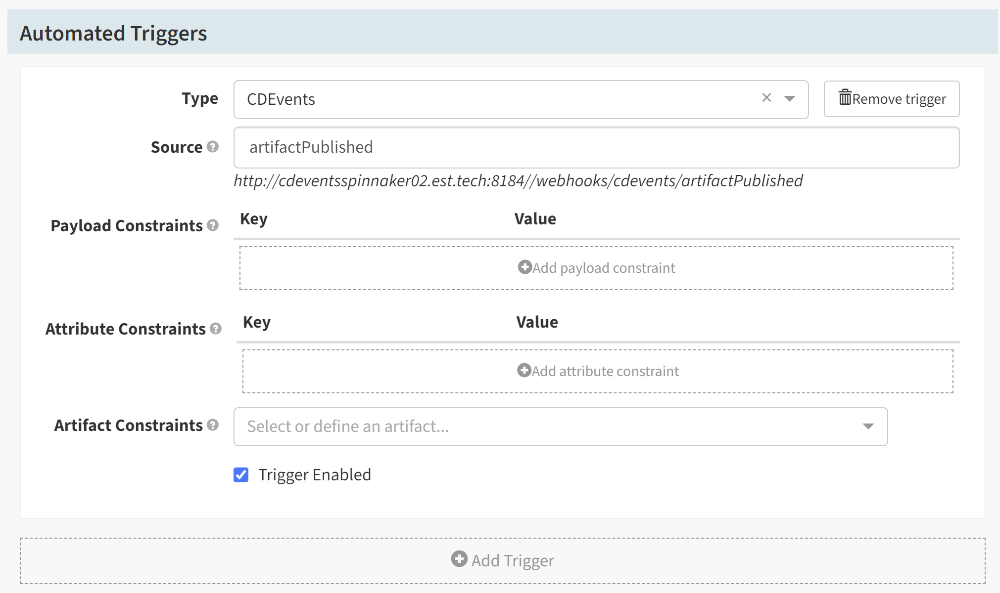
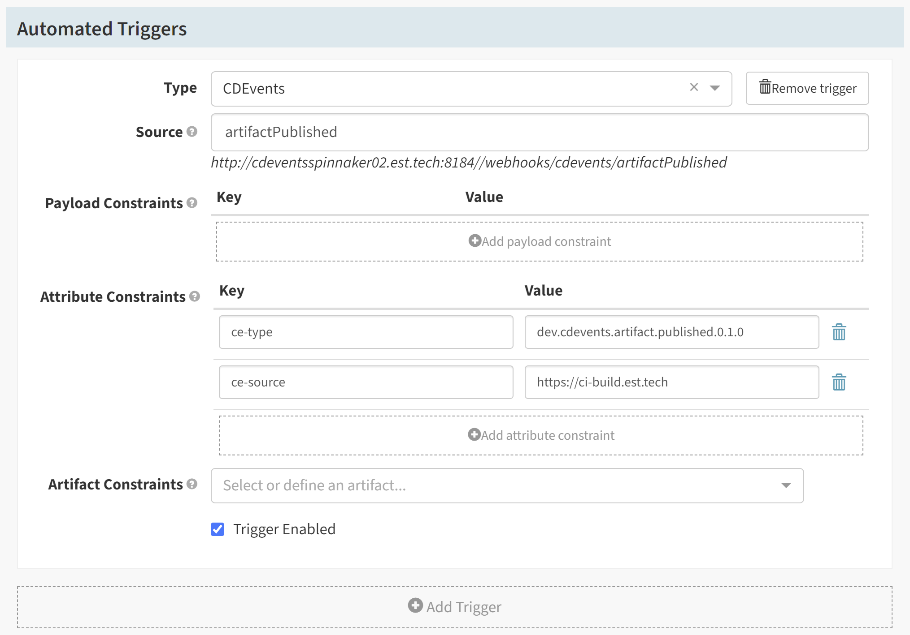
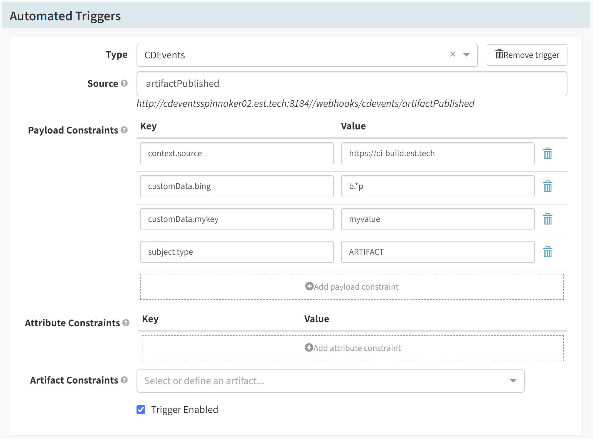
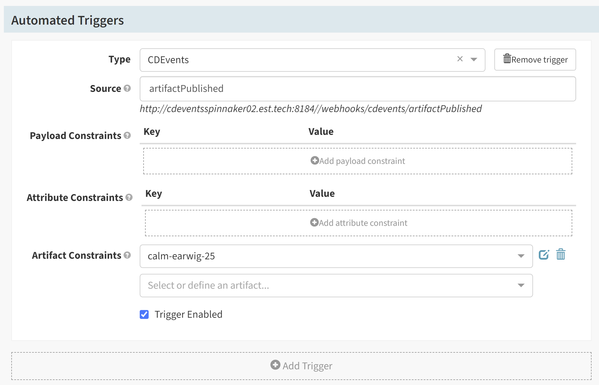
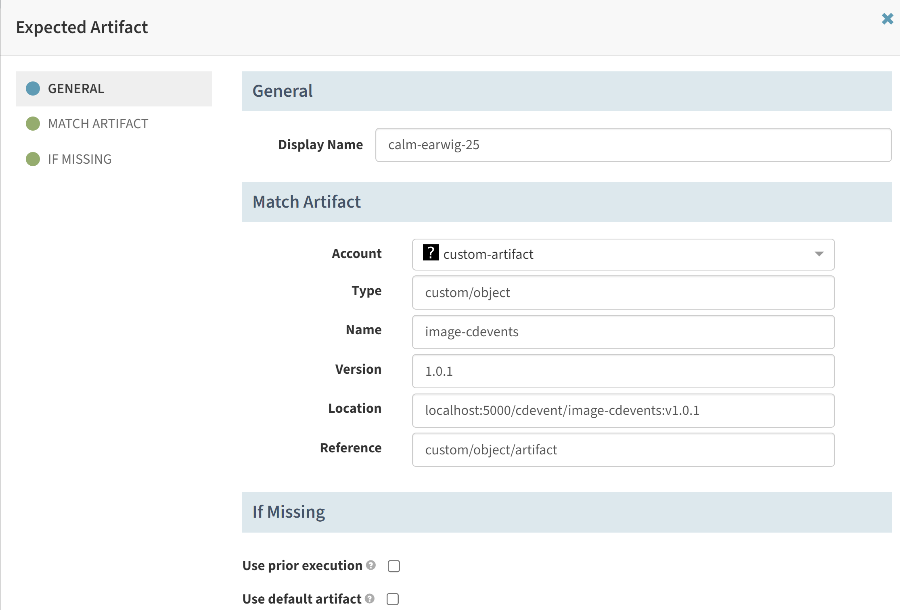

## About CDEvents
CDEvents is a common specification for Continuous Delivery events, it enables interoperability between the CI/CD tools.

CDEvents builds upon [CloudEvents](https://github.com/cloudevents/spec) by adding CI/CD specific extensions to CloudEvents [data](https://github.com/cloudevents/spec/blob/v1.0.1/spec.md#data) object as a payload, more details on types of CDEvents and specification can be found in the Documentation at http://cdevents.dev

In order to programmatically trigger pipelines, you can send a CDEvent via `POST` request to Spinnaker at a preconfigured endpoint or create a subscription with this endpoint for a specific CDEvent type in the [Message Broker](https://www.enterpriseintegrationpatterns.com/patterns/messaging/MessageBroker.html). You can use this to trigger pipelines from other CI/CD tools which supports Sending CDEvents through configured [Message Broker](https://www.enterpriseintegrationpatterns.com/patterns/messaging/MessageBroker.html), or from the command line, or from a third-party system.
The data payload will be available in the Pipeline's execution.

> **Note**:  You can trigger multiple pipelines with one CDEvent message.


If you're triggering to a Spinnaker with authentication, see the
instructions [here](/docs/setup/other_config/security/authorization/#automated-pipeline-triggers) to set up the
automated trigger.

## Prerequisites

* Artifact support [enabled](/docs/reference/artifacts/#enabling-artifact-support).

## Adding a CDEvents trigger to a pipeline

Assuming you've created a pipeline, under __Configuration__, select __Add
Trigger__ and make its type selector __CDEvents__.

To assign an endpoint that must be hit, you can provide a value to the
__Source__ field as shown here:



Notice that in the above image below the __Type__ dropdown, the endpoint
configuration points out that we can send CDEvent to
`http://localhost:8084/webhooks/cdevents/artifactPublished` to trigger the pipeline from localhost. The
endpoint depends on how you've configured your [Spinnaker endpoints](/docs/setup/other_config/security/) -- in the above image it is showing a different endpoint where Spinnaker is running. 

Keeping track of that endpoint as `$ENDPOINT` (it will depend on where
Spinnaker is installed), and save that pipeline.

You can run the below curl command to send a specific type of CDEvent that is built upon CloudEvent.
```bash
curl $ENDPOINT -X POST -H "Ce-Id: 123456789" -H "Ce-Specversion: 1.0" -H "Ce-Type: dev.cdevents.artifact.published.0.1.0" -H "Ce-Source: https://ci-build.est.tech" -H "Content-Type: application/json" -d $CDEVENTDATA
```
`$CDEVENTDATA` can be constructed as per [CDEvents-spec](https://github.com/cdevents/spec/blob/main/spec.md), to trigger the pipeline with different Payload constraints and HTTP headers can be used to trigger the pipelines with matching Attribute constraints.

### Attribute constraints
If you want to trigger the pipeline only when the specific headers are matching from the CDEvents webhook request, you can provide __Attribute constraints__ in the trigger configuration.

For example, If we configure the pipeline as below,

The attribute constraints used here `ce-type = dev.cdevents.artifact.published.0.1.0` and `ce-source = https://ci-build.est.tech` from the request.


### Payload constraints

If you want to ensure that a pipeline triggers only when a certain payload
arrives, you can provide __Payload Constraints__ in the trigger. These are
key/value pairs where the key must be found in the incoming payload, and the
value must match using regex.

For example, if we configured:


The payload constraints used here `context.source = https://ci-build.est.tech`, `customData.mykey = myvalue`, `customData.bing = b.*p` and `subject.type = ARTIFACT`."

The following `$CDEVENTDATA` payload would be accepted:

```json
{
  "context": {
    "id": "123456789",
    "type": "dev.cdevents.artifact.published.0.1.0",
    "source": "https://ci-build.est.tech",
    "version": "0.1.2"
  },
  "customData": {
    "mykey": "myvalue",
    "bing": "boooop",
    "x": ["1","2","3"]
  },
  "customDataContentType": "application/json",
  "subject": {
    "type": "ARTIFACT",
    "content": {
      "pipelineName": "test-1",
      "outcome": "SUCCESS"
    }
  }
}
```

But this payload would be rejected (pipeline would not trigger):

```json
{
  "context": {
    "id": "123456789",
    "source": "https://other-url.est.tech",
    ...
  },
  "customData": {
    "mykey": "myvalue",
    "x": ["1","2","3"]
  },
  "customDataContentType": "application/json",
  "subject": {
    "type": "PIPELINERUN",
    ...
  }
}
```


## Passing parameters

Say your pipeline accepted some parameters (for example, the desired stack to
deploy to), you can make this explicit by adding a pipeline parameter on the
same configuration screen as the CDEvents Automated trigger:


For more information on how to use pipeline parameters, see the [pipeline expressions guide](/docs/guides/user/pipeline/expressions)."

> Warning: there are several reserved parameter keys (names) that cause unexpected behaviour and failures
> if overwritten by a pipeline parameter definition.
> See the [list of reserved parameter and evaluate variable key names](/docs/guides/user/pipeline/expressions#list-of-reserved-parameter-and-evaluate-variable-key-names).

If you were to manually execute this pipeline, you would be prompted with the
following dialogue:


If instead you were to trigger this pipeline with a CDEvents Webhook request, you could supply each parameter a value inside a key/value map called `parameters` with in the `customData` of a `$CDEVENTDATA` payload. Take the
following payload for example:

```json
{
  "context": {
    "id": "5fb38d7d-28dd-47e4-ade2-cb21153cc8dc",
    ...
  },
  "customData": {
    "parameters": {
      "stack": "prod"
    }
  },
  "customDataContentType": "application/json",
  "subject": {
    "type": "ARTIFACT",
    ...
  }
}
```

> **Note**: If you select the __Required__ checkbox for a parameter without
> providing a default, the pipeline does not trigger if a parameter is not
> present. The difference between this and the preconditions covered earlier is
> that when a precondition isn't met, Spinnaker doesn't even try to run the
> pipeline. However, when a required parameter doesn't exist, Spinnaker tries
> and fails to run a pipeline, surfacing a "Failed Execution" in the UI.

## Passing artifacts

If your pipeline requires artifacts (for example, a custom artifact stored in a specific location), you can make this explicit by defining an __Expected Artifact__
and assigning it to the CDEvents Webhook as shown below:




In order to run this pipeline, you will need to supply the required artifact in the `customData` of a `$CDEVENTDATA` payload under a list of `artifacts`:

```json
{
  "context": {
    "id": "5fb38d7d-28dd-47e4-ade2-cb21153cc8dc",
    ...
  },
  "customData": {
    "artifacts": [
      {
        "type": "custom/object",
        "name": "image-cdevents",
        "version": "1.0.1",
        "location": "localhost:5000/cdevent/image-cdevents:v1.0.1"
        "reference": "custom/object/artifact"
      }
    ]
  },
  "customDataContentType": "application/json",
  "subject": {
    "type": "ARTIFACT",
    ...
  }
}
```
