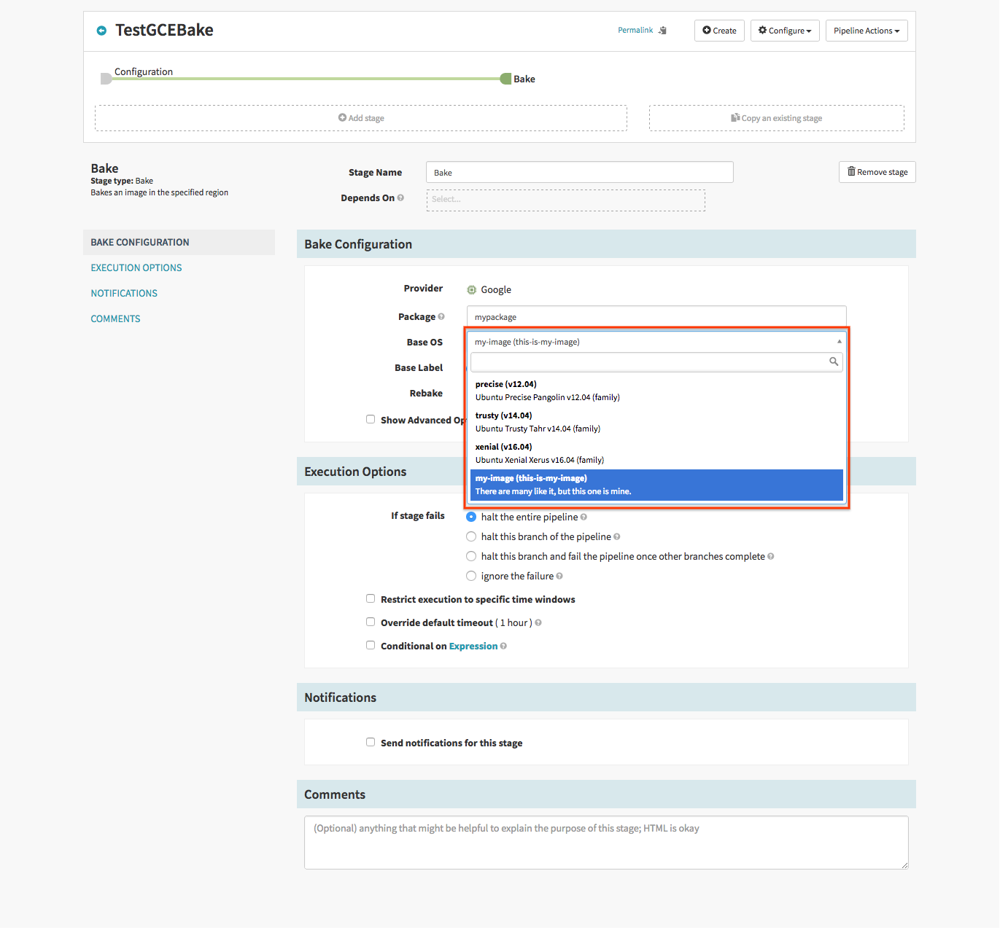

The GCE bakery configuration allows you to set the default network and zone and whether to use the public IP
address of the VM used for baking the image.

For example, to set the default zone, add to the `rosco-local.yml` the 
following configuration

```yaml
google:
  enabled: true
  bakery-defaults:
    zone: <zone>
    network: <network>
    networkProjectId: projectId
    subnetwork: subnetwork
    useInternalIp: <true|false>
    templateFile: gce.json
    baseImages:
    - id: unique-bake-id
      shortDescription: shortUI Description (aka precise)
      detailedDescription: Ubuntu precise
      packageType: rpm
      templateFile: gce.json
      osType: <defaults to Linux>
      customRepository: customRepoURL
      isImageFamily: // this is unique to google.  
```
These base images are used to dynamically populate the bake stage UI:

For more examples see the [default rosco.yml example file](https://github.com/spinnaker/spinnaker/blob/86a21d18f967615ccad319c23463e2ac1bc6d1a1/rosco/rosco-web/config/rosco.yml#L382)


