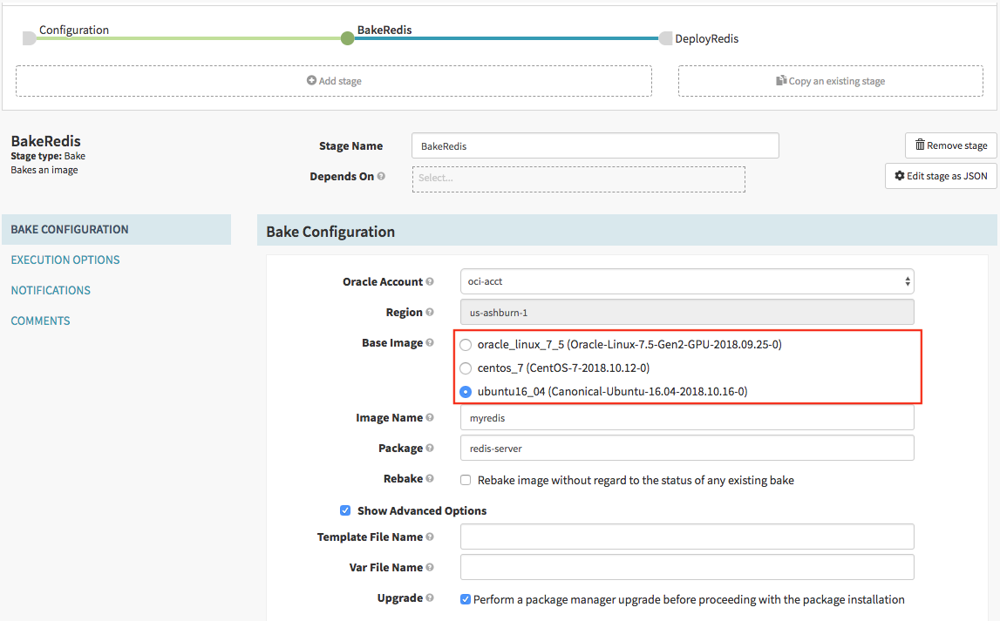

The Oracle Cloud Infrastructure (OCI) bakery configuration allows for setting the default availability domain, network,
and instance shape of the VM used for baking the image.  Add the following to `rosco-local.yml` to enable oracle
account baking.

```yaml
oracle:
  enabled: true
  bakery-defaults:
    availabilityDomain:
    subnetId:
    instanceShape:
    templateFile: oracle.json
    baseImages:
      baseImageId: 
      sshUserName: 
      packageType: rpm
```

These images are used to dynamically populate the bake stage UI:


For more information, look at the oracle [bake code in rosco](https://github.com/spinnaker/spinnaker/tree/main/rosco/rosco-core/src/main/groovy/com/netflix/spinnaker/rosco/providers/oracle/config)
