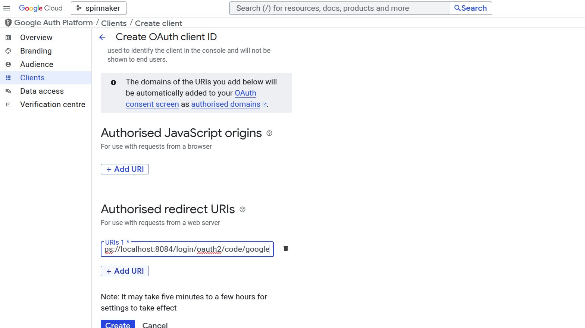

This page instructs you on how to obtain an OAuth 2.0 client ID and client secret for use with your G Suite organization
(previously known as Google Apps for Work).

## Get client ID and secret
1. Navigate to [https://console.developers.google.com/apis/credentials](https://console.developers.google.com/apis/credentials).
2. Click "Create credentials" --> OAuth client ID.
3. Select "Web Application", and enter a name.
4. Under "Authorized redirect URIs", add `https://localhost:8084/login/oauth2/code/google` (For Spinnaker below
   v2025.2.0, it should be `https://localhost:8084/login`), replacing domain with your Gate address,
   if known, and `https` with `http` if appropriate. Click Create.
5. Note the generated client ID and client secret. Copy these to a safe place.




## Configure Gate

Spinnaker uses [spring properties as seen in their documentation](https://docs.spring.io/spring-security/reference/servlet/oauth2/index.html#oauth2-client-log-users-in)
for configuring oauth2 today.  Add the following properties to `gate-local.yml`
```yaml
spring:
  security:
    oauth2:
      client:
        registration:
          userInfoMapping:
            email: email
            firstName: given_name
            lastName: family_name
          userInfoRequirements:
            hd: <domain>
          google:
            client-secret: <client-secret>
            scope: profile,email
            client-id: <client-id>
        provider:
          google:
            user-info-uri: https://www.googleapis.com/oauth2/v3/userinfo
            authorization-uri: https://accounts.google.com/o/oauth2/v2/auth
            token-uri: https://www.googleapis.com/oauth2/v4/token
```
Note that `userInfoRequirements` is a spinnaker specific extension to do validation on attributes from the user info.  See [the main oauth docs](../) for more information.

### For spinnaker versions before 2025.2.0

Though no longer supported, these would work on versions prior to 2025.2.0

```yaml
security:
  authn:
    oauth2:
      enabled: true
      client:
        clientId: # client ID from above
        clientSecret: # client secret from above
        accessTokenUri: https://www.googleapis.com/oauth2/v4/token
        userAuthorizationUri: https://accounts.google.com/o/oauth2/v2/auth
        scope: profile,email # for Spinnaker below v2025.2.0, it should be "profile email" without double quotes
      resource:
        userInfoUri: https://www.googleapis.com/oauth2/v3/userinfo
      userInfoRequirements:
        # You almost certainly want to restrict access to your Spinnaker to
        # users whose account is from your hosted domain; without this any
        # user with a Google account will have access.
        hd: # hosted domain
      userInfoMapping:
        email: email
        firstName: given_name
        lastName: family_name
      provider: GOOGLE
```