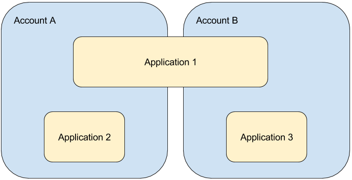
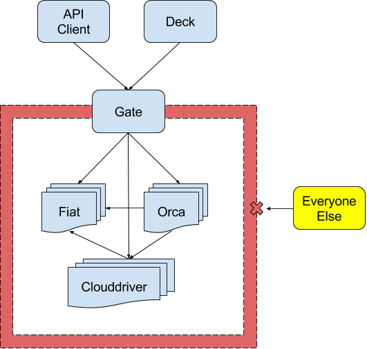
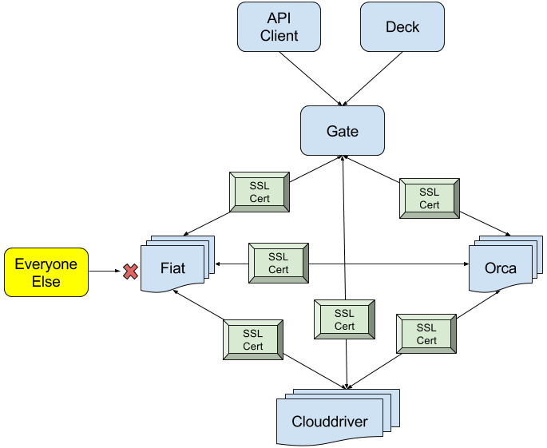
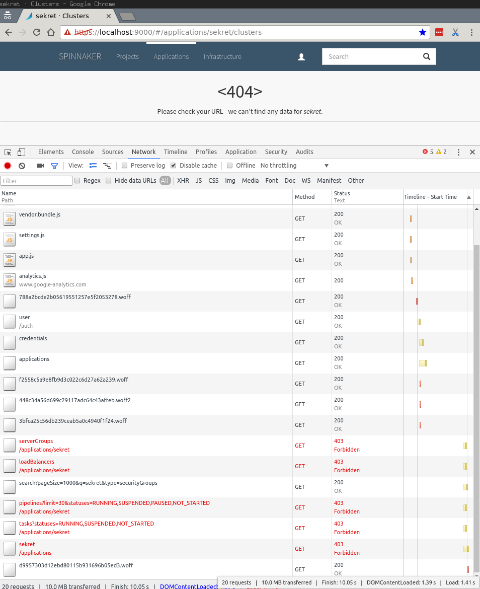

## Overview

Fiat (Fix it Again Travis) is the authorization (authz) microservice of Spinnaker. It can grant access to users 
to execute pipelines, view infrastructure, etc. It is disabled by default. Much like authentication, Spinnaker allows for a 
variety of pluggable authorization mechanisms. 

With Fiat, you can&hellip;

* Restrict access to specific [accounts](#accounts).
* Restrict access to specific [applications](#applications).
* Run pipelines using [automated triggers](#automated-pipeline-triggers) against access-controlled applications.
* Use and periodically update user roles from a backing [role provider](#role-providers).

Permissions can be attached to applications and (provider) accounts. A permission associates a role with one of these
 options: `READ`, `WRITE`, or `EXECUTE` (for apps only).
 
## Important notes

Keep these in mind as you consider your authorization strategy:

1) Fiat's authorization model is an approve list that is open by default. In other words, when a resource does _not_ 
define who is allowed to access it, it is considered unrestricted.  This means:
   * If an account is unrestricted, any user with access to Spinnaker can deploy a new application
   to that account.
   * If an application is unrestricted, any user with access to Spinnaker can deploy that
   application into a different account. They may also be able to see basic information like
   instance names and counts within server groups.

1)  Every permission in Spinnaker is granted to a role. Individual users cannot be granted permissions. You also grant
 [Super admin](/docs/setup/other_config/security/admin/) access to a role. You may see discussions of users in Fiat’s implementation but
  it’s just an optimization in the storage to not recompute user → roles → permissions.

1)  Account and application access control can be confusing unless you understand the core
relationship: accounts can contain multiple applications, and applications can span multiple
accounts.  Giving access to an account does not grant access to the application and vice versa.  Sometimes you need 
both permissions to perform certain actions.



## Requirements

* [Authentication](../authentication) successfully setup in Gate.

* An external role provider from one of the following:
    * Google Groups via a G Suite Account
        * With access to the G Suite Admin console
    * GitHub Organization
    * LDAP server
    * SAML Identity Provider (IdP) that includes groups in the assertion
        > SAML roles are fixed at login time, and cannot be changed until the user needs to
        reauthenticate.
    * OAUTH2 with groups in the claims

* Enable fiat in the `spinnaker.yml` file.  This enables services to query fiat for auth information.

* (Highly Suggested) All Spinnaker component microservices are either:
    * Firewalled off as a collective group, or:

        

    * Use mutual TLS authentication:

        


## Implementation

### Accounts
 Because Clouddriver is the source of truth for cloud accounts, Fiat reaches out to Clouddriver
to gather the list of available accounts. There are two types of access restrictions to an account: `READ` and 
`WRITE`. Users must have at least one `READ` permission of an account to view the account's cloud resources, and at 
least one `WRITE` permission to make changes to the resources.

Every cloud provider, and many OTHER account types like those in igor for CI systems can set permissions.  You'll
set these permissions by modifying the account with a `permissions` set of entries that contain the roles/groups
that you want to grant READ/WRITE permissions.  

```yaml
google:
  accounts:
  - name: my-google-account
    permissions:
      READ:
      - role1
      - role2
      WRITE:
      - role1
      - role2
```
NOTE That READ permissions ARE NOT implicitly granted by giving WRITE permissions.  AS SUCH it's HIGHLY recommended
to ALWAYS add READ to any WRITE access.

## Applications
Applications have three levels of permissions:  `EXECUTE`, `READ` and `WRITE` permissions. 

{}
By DEFAULT, `READ` permissions ALSO grant `EXECUTE` permissions.  To adjust this, 
* Make sure you have `EXECUTE` set as needed for your applications
* Flip the default behavior across all applications to only grant `WRITE` users implicit `EXECUTE` access by
setting the following property in `fiat-local.yml`:

```yml
fiat:
  executeFallback: 'WRITE'
```

### Examples of required permissions

- To delete a load balancer in account Z, you need to have `WRITE` permission on the account.
- To update a pipeline in an app, you need `WRITE` permission on that app.
- You can run a pipeline with just the `EXECUTE` permission.
- To successfully run a pipeline in app X that deploys to account Y, you need (at least)  `EXECUTE` on the app X and
 `WRITE` on the account Y.

## Role Providers
In Spinnaker there are a few ways you can associate a role with a user:

- With a [YAML file](https://github.com/spinnaker/spinnaker/blob/main/fiat/fiat-file/src/test/resources/fiat-test-permissions.yml): contains user ↔ role mapping. A YAML parseable map with structure [user]: list of roles
- Via [GitHub Teams](./github-teams/): roles are the teams a user belongs to in a configured Org
- Via [Google Groups](./google-groups/): roles are mapped (see settings) from the Google directory
- Via [LDAP](./ldap/): roles are searched in LDAP from the user
- Via [SAML Groups](./saml/) (also covers OAuth ONLY with OIDC): The authentication method can also bring its own roles. In this case, roles are referred
 in Fiat as `EXTERNAL`. They can be used in addition to authorization roles.
 
In all these methods, users are referenced by a userId which is determined by the authentication method of your choice.

## Effects of restrictions

Because of the new access restrictions, `https://localhost:9000/#/applications` should no longer
list applications that have been restricted. Even navigating to the previously accessible page
should be denied:



## Automated pipeline triggers

A popular feature in Spinnaker is the ability to run pipelines automatically based on a
triggering event, such as a `git push` or a Jenkins build completing. When pipelines run against
accounts and applications that are protected, it is necessary to configure
them with enough permissions to access those protected resources. This can
be done in two ways:

* Using [Pipeline Permissions](./pipeline-permissions/) - this is an automatic creation of service accounts on demand.
* Using a Fiat [service account](./service-accounts/)

## Reference documentation
[Deeper details on Authorization in Spinnaker](/docs/reference/architecture/authz_authn/authorization/)
