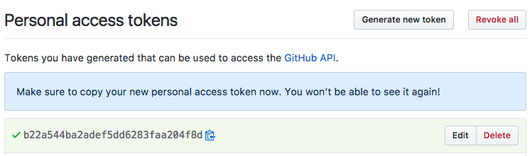

## GitHub App Authentication (Recommended)

GitHub App authentication, available in releases after 2025.4.0, is the preferred method for connecting Spinnaker to GitHub. It offers significant advantages over Personal Access Tokens (PATs):

*   **Higher Rate Limits**: GitHub Apps have a rate limit of [15,000](https://docs.github.com/en/rest/using-the-rest-api/rate-limits-for-the-rest-api?apiVersion=2022-11-28#primary-rate-limit-for-authenticated-users) requests per hour (vs [5,000](https://docs.github.com/en/rest/using-the-rest-api/rate-limits-for-the-rest-api?apiVersion=2022-11-28#primary-rate-limit-for-authenticated-users) for PATs).
*   **Enhanced Security**: Uses short-lived tokens that are automatically refreshed, rather than long-lived static tokens.
*   **Granular Permissions**: Apps can be scoped to specific permissions.

### Prerequisites

*   You have GitHub organization admin permissions to create and install the app.

### 1. Create a GitHub App

1.  Navigate to your GitHub Organization Settings > Developer settings > GitHub Apps.
2.  Click **New GitHub App**.
3.  Set the following fields:
    *   **GitHub App Name**: e.g., `spinnaker-fiat-auth`.
    *   **Homepage URL**: Your Spinnaker URL (or placeholder).
    *   **Callback URL**: Your Spinnaker URL (or placeholder).
    *   **Webhook**: Uncheck "Active" (not needed for authorization).
4.  **Permissions**:
    *   **Organization Permissions > Members**: Read-only
5.  Click **Create GitHub App**.
6.  Note the **App ID**.
7.  Generate a **Private key** and save the `.pem` file.
8.  **Install App**: Go to "Install App" in the sidebar and install it on your organization. Note the **Installation ID** from the URL (e.g., `https://github.com/organizations/my-org/settings/installations/12345678` -> `12345678`).
    *   Install at the organization level (not per-repo) so team membership lookups work for all repos.

*   GitHub App installation tokens are short-lived (1 hour) and Fiat caches them in memory with an early refresh buffer. They are never written to disk.
*   PATs configured with `--accessToken` are stored in Fiat configuration; rotate them periodically and handle them like any other long-lived secret.

## Personal Access Token (Legacy)

If you cannot use a GitHub App, you can still use a Personal Access Token (PAT). Note that this has lower rate limits.

1. Under an administrator's account, generate a new Personal Access Token from
   [https://github.com/settings/tokens](https://github.com/settings/tokens).
1. Give it a descriptive name such as "spinnaker-fiat."
1. Select the `read:org` scope.
1. Click "Generate Token"




## Configure Fiat

Add the following configuration to `fiat-local.yml` to have fiat load group membership from github:
```yaml
auth:
  group-membership:
    service: github
    github:
      ## When to refresh group info
      membershipCacheTTLSeconds: 600
      ## 1000 github teams
      membershipCacheTeamsSize: 1000
      ## Defaults to 100
      paginationValue: 100 
      ## AUTO == Pick based upon what config is set and defaulting to GH Apps as first priority
      authMethod: AUTO 
      baseUrl: https://api.github.com/
      organization: my-org
      ## When using a PAT:
      accessToken: PAT 
      ## When using a GH App
      appId: 12345
      installationId: 67894
      privateKeyPath: encryptedFile:orVolumePath
```

The `authMethod` property controls which authentication method Spinnaker uses:
*   `AUTO` (Default): Automatically prefers GitHub App if `app-id`, `installation-id`, and `private-key-path` are configured. Falls back to PAT if App credentials are missing.
*   `GITHUB_APP`: Forces GitHub App authentication. The configuration fails if App credentials are not provided or invalid.
*   `PAT`: Forces Personal Access Token authentication. The configuration fails if `access-token` is not provided.
